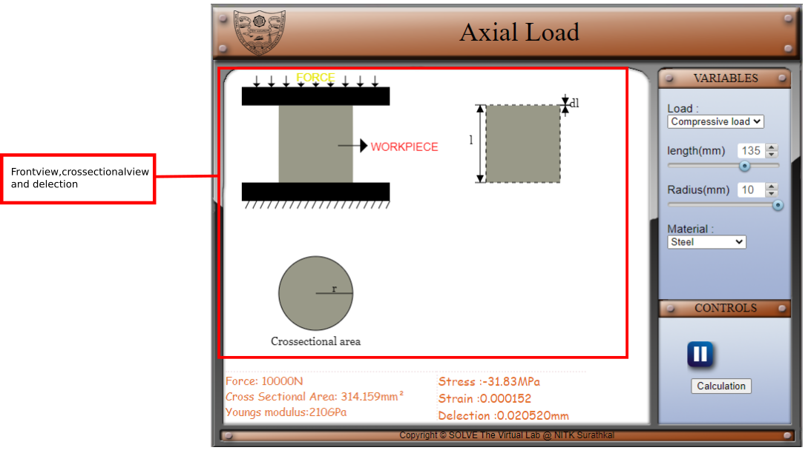
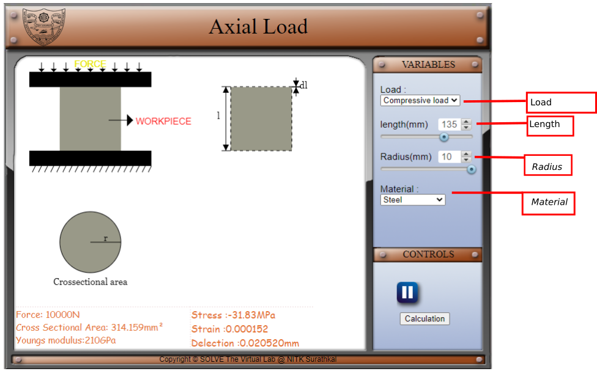
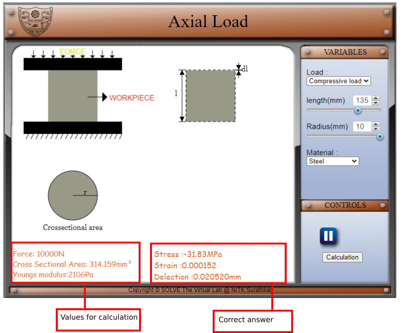
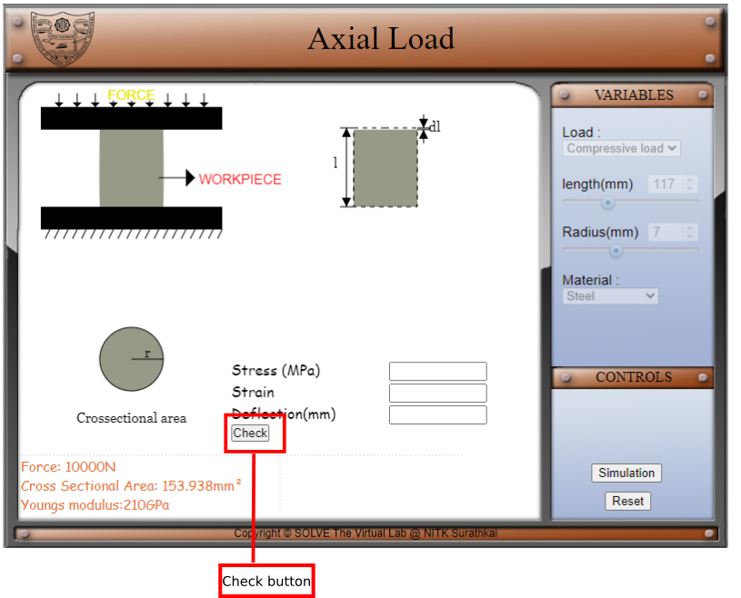
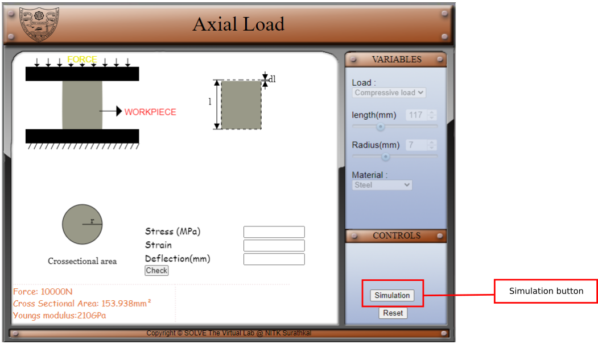

#### These procedure steps will be followed on the simulator

1. In the simulation window, the front view, cross-sectional area and deflection  of a object under load is shown.

 

 

2. Type of load and material can be selected using drop down menu, length  and radius can be varied using knob provided. Changing these variable will effect the animation shown.

 
3. Values for calculation are displayed on left comment box and the correct answer for calculation are displayed on right comment box.

 

4. Click on calculation button to take a test.

 

5. Enter the required value in the user input box provided, click on check to see the result.

 

6. Click on simulation button to return to simulation screen.

 
