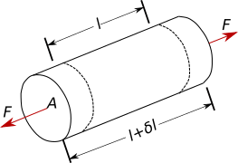
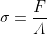
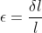

## INTRODUCTION 

#### User Objectives and Goals:

1. Define stress, strain and deflection under load
2.  Describe how axial load effects a body..
3.  Apply the mathematical equations acting on a body under axial load
4.  Examine and compare the calculated values with the simulation.
5. Evaluate how change in area, force and material effect the stress and strain acting on a body.  Attempt assessment questions.

#### Theory

Load is defined as any external force acting on machine part, there many types of load one of them being axial load. The forces acting along the axis is known as axial load

When a body is acted upon by external force/load, internal resisting force is set up, such a body is said to be in a state of stress, hence stress is the resistance is the resistance offered by the body to deformation. The internal resistance offered against the external load force may be assumed as uniformly distributed over the whole area of cress section. Thus this internal force per unit area at any section of the body is known as stress. It is denoted by σ(sigma).

When a force or load acts on a body it undergoes deformation. This deformation per unit length is know as unit strain or strain. It is denoted by ε(epsilon) or e.

Hooke’s law states that a when a material is loaded within elastic limit, the stress is directly proportional to strain. i.e, the ratio of stress to strain is a constant within elastic limit. This constant is known as Modulus of Elasticity or “Young’s Modulus”. It is denoted by E.

#### Equations/formulas:

Let

= Force acting on the object
 

= Cross-sectional area
 

=length of the object
 
 = Change in length

 

and strain  is given by, 

 

The relationship between stress and strain under elastic limit is given by, 

 

or 

 

where, = Young's modulus of the material
