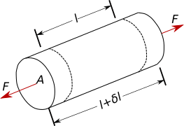
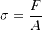
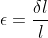
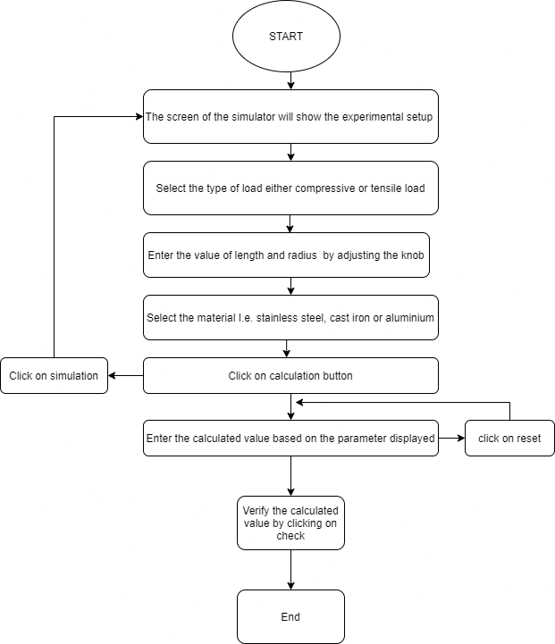
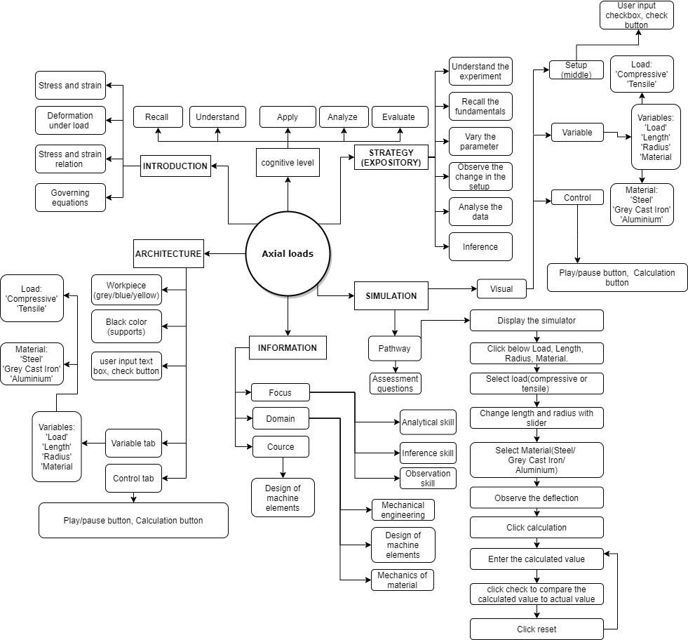
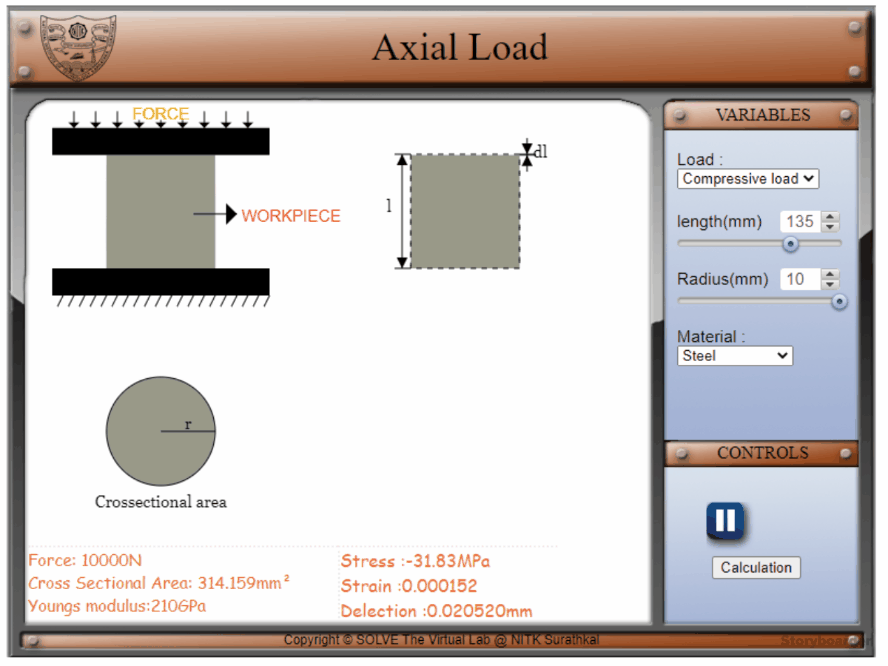

## Storyboard (Round 2)

Experiment: Disc Type Flywheel

**1. Story Outline**:

Load is defined as any external force acting on machine part, there many types of load one of them being axial load. The forces acting along the axis is known as axial load

When a body is acted upon by external force/load, internal resisting force is set up, such a body is said to be in a state of stress, hence stress is the resistance is the resistance offered by the body to deformation. The internal resistance offered against the external load force may be assumed as uniformly distributed over the whole area of cress section. Thus this internal force per unit area at any section of the body is known as stress. It is denoted by σ(sigma).

When a force or load acts on a body it undergoes deformation. This deformation per unit length is know as unit strain or strain. It is denoted by ε(epsilon) or e.

Hooke’s law states that a when a material is loaded within elastic limit, the stress is directly proportional to strain. i.e, the ratio of stress to strain is a constant within elastic limit. This constant is known as Modulus of Elasticity or “Young’s Modulus”. It is denoted by E.

 **2. Story**:

  **2.1 Set the visual stage description**:
  

  The experiment consists of an object subjected to axial load condition whose geometry and material can be changed. On the left hand side of simulation window the objects side view, cross-sectional and deflection can be seen. On the right hand side of simulation window the geometry of the object like length and radius can be varied with the help of knobs, the material and type of axial load can be selected using drop down menu

  In, side view we can see circular rod supported by two black bars, the color of the rod changes based on the selected material and also the direction of force acting on the rod also changes with the selected  load.

  In the comment box on left bottom of the simulation window the required data for calculation is displayed. On the right bottom of the simulation window we can see the correct calculated result.
  When calculation button is pressed on right bottom of simulation window, three user input boxes will be displayed to enter the required calculated value based on variables and constant displayed. To reset the simulation window a simulation button is provided on the bottom right side.
  

  **2.2 Set User Objectives & Goals**:
* Define stress, strain and deflection under load
* Describe how axial load effects a body..
* Apply the mathematical equations acting on a body under axial load
* Examine and compare the calculated values with the simulation.
* Evaluate how change in area, force and material effect the stress and strain acting on a body.  Attempt assessment questions.

  **2.3 Set the pathway activities**:

  1. Initially side-view, cross-sectional area and deflection of an object under load will be displayed
  2. Select type of stress, change variables and select material and observe the changes in simulation
  3. Calculate the required values and compare with the displayed value
  4. Click on calculation to take a test
  5. Click on simulation to return to simulation screen

  **2.4 Set Challenges and Questions/Complexity/variation**

  **2.4.a Questions before simulation**:

  1. Stress is
  <ol type=a>
      <li>Internal restive force</li>
      <li>Axial load</li>
      <li>Radial load</li>
      <li>External load</li>
  </ol>
  Answer a

  2. When tensile load is applied on a circular rod
  <ol>
      <li>Diameter increases</li>
      <li>Length increases</li>
      <li>Length decreases</li>
      <li>None of the above</li>
      </ol>
  Answer b  

3.  Compressive strain is
<ol type=a>
    <li>Change in volume / original volume</li>
    <li>Decrease in length/ original length</li>
    <li>Increase in length/ original length</li>
    <li>Original length/ increase in length</li>
    </ol>
Answer b

4. Tensile strain is
<ol>
    <li>Change in volume / original volume</li>
    <li>Decrease in length/ original length</li>
    <li>Increase in length/ original length</li>
    <li>Original length/ increase in length</li>
        </ol>
Answer c

5. Young's modulus is
<ol>
    <li>Tensile stress / tensile strain</li>
    <li>Shear stress / shear strain</li>
    <li>Shear strain/ tensile strain</li>
    <li>Tensile strain/ tensile stress </li>
        </ol>
Answer a

**2.4.b Questions after simulation**

1. Hook’s law applicable within
<ol type=a>
    <li>Plastic limit</li>
    <li>Elastic limit</li>
    <li>Fracture point</li>
    <li>None of the above</li>
    </ol>
Answer b

2.  A circular rod of 17mm diameter is subjected to a load of 500N. The stress in N/mm² is
  <ol type=a>
      <li>18.55</li>
      <li>7.41</li>
      <li>8.81</li>
      <li>10</li>
      </ol>
  Answer c

3.  When compressive load is applied on a circular rod
 <ol>
     <li>Diameter increases</li>
     <li>Length increases</li>
     <li>Volume increases</li>
     <li>None of the above</li>
         </ol>
 Answer a
4. A cord has original length of 100cm is pulled by a force, if change in length of cord is 2mm what is the strain?
  <ol type=a>
      <li>0.2</li>
      <li>1</li>
      <li>0.0002</li>
      <li>0.002</li>
      </ol>
Answer: b

5. A load of 5KN is to be raised with the help of a steel wire. Find the minimum diameter of wire if stress is not to exceed 100MPa
<ol type=a>
    <li>7.98</li>
    <li>8.53</li>
    <li>9.98</li>
    <li>7</li>
    </ol>
Answer a

**2.5 Allow pitfalls: NA**

**2.6 Conclusion**:

Time required to perform the virtual experiment.
The approximate time required to understand the procedure to perform the experiment would take about 5 min. The time required to enter the input variables and calculate the unbalanced masses is 15 min. Thus, if the calculated answers are correct, the total time required to perform the experiment will be around 20 min.

**2.7 Equations/formulas:**

Let

= Force acting on the object

= Cross-sectional area

= length of the object

 = Change in length

<!-- # Below are the examples added for reference.
# To get mathematical equatios in html format: go to link: https://www.codecogs.com/latex/eqneditor.php and download equations in png format
# In the same link you have option to download equation as punching

### using png

//markdown syntax -->

then stress  is given by,  
 

and strain  is given by, 
 

The relationship between stress and strain under elastic limit is given by, 
 
or 
 

where, = Young's modulus of the material

<!-- //html syntax

 -->

**3. Flowchart**:

**4. Mindmap**:

**5. storyboard**:
1. In the simulation window, the front view, cross-sectional area and deflection  of a object under load is show

2. Type of load and material can be selected using drop down menu, length  and radius can be varied using knob provide. changing these variable will effect the animation shown

3. Values for calculation are displayed on left comment box and correct answer for calculation displayed on right comment box

4. Click on calculation button to take a test
5. Enter the required value in the user input box provided Click on check to see the result
6. Click on simulation button to return to simulation screen

**6. References**:

Dessign of Machine  Elements - V.B.Bhandari 
Dessign of Machine  Elements I - J.B.K. Das, P.L.. Srinivasa Murthy
https://nptel.ac.in/courses/112/105/112105125/.
